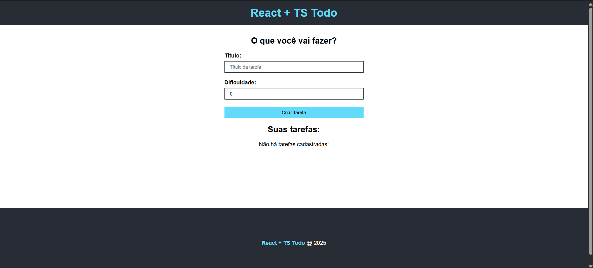

# 🧠 Curso de TypeScript — Do Básico ao Avançado (c/ React, Express)

Este repositório reúne os **projetos desenvolvidos por mim, Danielle Couto Calil, durante o curso TypeScript do básico ao avançado (com React, Express)**, ministrado por Matheus Battisti na plataforma Udemy.

O curso teve duração de **14 horas**, com foco em aplicar tipagem estática e segura ao desenvolvimento de aplicações modernas com React e Express. 
Foram abordados desde os fundamentos da linguagem até integrações práticas com bibliotecas populares.

---

## 📁 Projetos Desenvolvidos

### ✅ Todo-list-React-com-Typescript — Lista de Tarefas com React e TypeScript

🗂️ Um gerenciador simples de tarefas (To-do list) criado com React + TypeScript.

**📌 O que foi trabalhado:**

- Tipagem explícita de useState e props

- Manipulação de arrays de objetos com tipagem personalizada (Task[])

- Componentes funcionais reutilizáveis com interfaces tipadas

- Eventos de formulário (onChange, onSubmit) com tipos corretos

- Atualização e exclusão de tarefas com segurança de tipo

## 📸 Prévia do Projeto

---

### 🌐 API-Restful-com-TS — API de Usuários com Express e TypeScript

🔗 Uma API RESTful simples, totalmente escrita em TypeScript e estruturada com boas práticas.

**📌 O que foi trabalhado:**

- Configuração do TypeScript no back-end (tsconfig, ts-node)

- Tipagem de Request e Response do Express

- Criação de DTOs (Data Transfer Objects) com validação

- Separação por camadas: routes, controllers, services

- Tratamento de erros com middlewares e mensagens tipadas

## 📸 Prévia do Projeto

API funcional testada com Postman, retornando dados de tarefas de forma segura e tipada

---

## 🧠 Conhecimentos Aplicados

- Tipos primitivos, arrays, tuplas e enums
- Interfaces e tipos personalizados (type, interface)
- Funções genéricas e reutilizáveis
- Props e eventos tipados no React
- Rotas, controllers e serviços no Express com TS
- Middlewares personalizados com tipagem
- Organização de projetos escaláveis
- Boas práticas com ESLint, Prettier e tsconfig.json